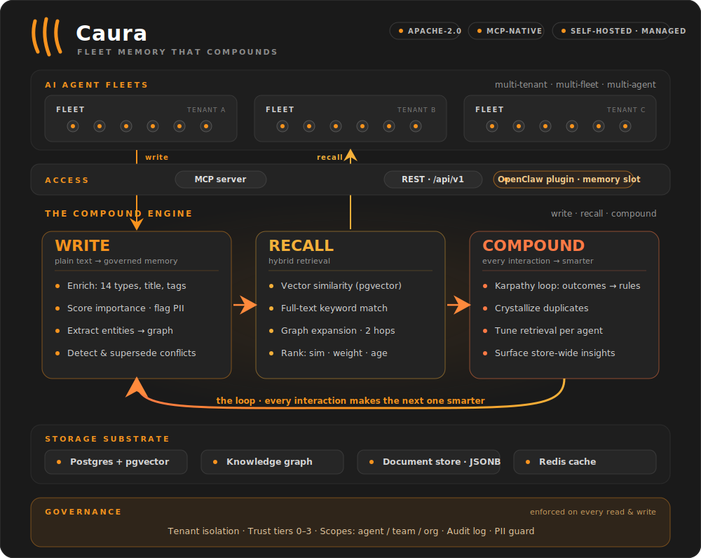
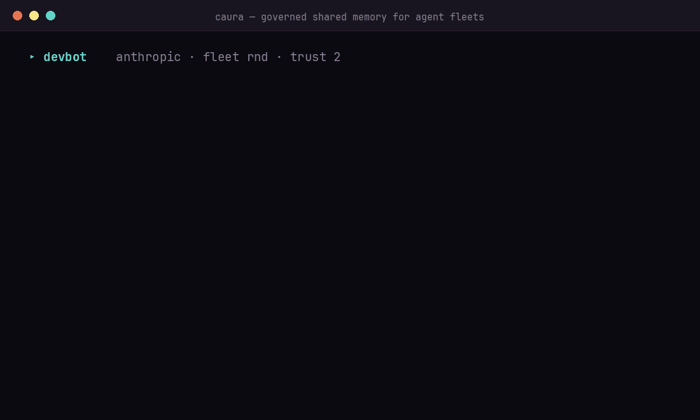

<h1 align="center">Caura &mdash; Shared governed memory for AI agents</h1>

<h3 align="center">Fleet memory for AI agents &mdash; governed, shared, self-improving.</h3>

<p align="center"><strong>MemClaw is now Caura</strong> &mdash; same product, one name.<br /> <!-- legacy-name-ok: taught as legacy alias -->
Tools are <code>caura_*</code>; the old <code>memclaw_*</code> names, packages, env vars and URLs keep working unchanged.</p> <!-- legacy-name-ok: taught as legacy alias -->

<p align="center">
  <a href="LICENSE"></a>
  <a href="https://github.com/caura-ai/caura/stargazers"></a>
  <a href="https://github.com/caura-ai/caura/actions"></a>
  <a href="https://github.com/caura-ai/caura/releases"></a>
  <a href="https://discord.com/invite/aNfpgfpj"></a>
</p>

<p align="center">
  <a href="#quick-start">Quick Start</a> &middot;
  <a href="#features">Features</a> &middot;
  <a href="#performance">Performance</a> &middot;
  <a href="#mcp-model-context-protocol">MCP</a> &middot;
  <a href="#api-reference">API Reference</a> &middot;
  <a href="static/docs/integration-guide.md">Plugin Docs</a> &middot;
  <a href="CONTRIBUTING.md">Contributing</a> &middot;
  <a href="https://discord.com/invite/aNfpgfpj">Discord</a>
</p>

---

## Caura (formerly MemClaw) — the shared governed memory layer for AI agent fleets <!-- legacy-name-ok: taught as legacy alias -->

Caura — formerly MemClaw — is open-source memory for **multi-tenant, multi-agent** AI fleets. Your agents store what they learn, find what the fleet knows, and get smarter with every interaction — learning from each other instead of repeating mistakes. <!-- legacy-name-ok: taught as legacy alias -->

Agents write plain text. Caura turns it into searchable, governed, self-improving memory.

**One loop, three pillars: write, recall, compound** — every interaction makes the next one smarter.

**Optimized for fleets.** One agent works, and that's where most teams start — nothing below changes for a single-agent setup. What Caura adds is headroom: scoped memory, cross-agent outcome propagation, and fleet-wide trust tiers are there from the first write, and they keep paying off as agents multiply. Public agent-memory benchmarks (LoCoMo, LongMemEval) measure one agent, one user, one long conversation — the single-chatbot shape — so they score the on-ramp rather than the axes that compound with agent count: latency, token efficiency, and governance. That second shape is what we see in production: dozens or thousands of agents working on behalf of one company, sharing what they learn under governance. See [Performance](#performance) for the numbers, or read the [benchmarks write-up](https://caura.ai/blog/caura-benchmarks).

> **In production at eToro (NASDAQ: ETOR):** 300+ AI agents on one governed
> memory — 26,500+ memories, 1,372 shared skills, 23 ms p50 search.
> [Architecture deep-dive →](https://caura.ai/blog/etoro-company-brain/)

<p align="center">
  
</p>

<p align="center">
  
</p>

---

## Quick Start

### Try it locally — no API key, no signup

The fastest way to see Caura work. Standalone mode runs single-tenant with auth bypassed — start Caura, write a memory, and find it again. (It boots with dummy embeddings so there's nothing to configure; add an AI provider key for semantic search — see [Self-Hosted](#self-hosted-open-source) below.)

```bash
git clone https://github.com/caura-ai/caura.git
cd caura
cp .env.example .env && echo "IS_STANDALONE=true" >> .env   # single-tenant, no API key
docker compose up -d --wait                                 # Postgres + pgvector + Redis + API (~30s)
```

<!-- readme-quickstart-ci:start -->
```bash
# Write a memory — no API key needed
curl -X POST http://localhost:8000/api/v1/memories \
  -H "X-API-Key: standalone" -H "Content-Type: application/json" \
  -d '{"tenant_id": "default", "agent_id": "quickstart", "content": "Our auth service uses JWT with 15-minute expiry."}'

# Find it by keyword — no provider key needed
curl -X POST http://localhost:8000/api/v1/search \
  -H "X-API-Key: standalone" -H "Content-Type: application/json" \
  -d '{"tenant_id": "default", "query": "JWT expiry"}'
```
<!-- readme-quickstart-ci:end -->

The keyless write response includes `memory_type`, `title`, `status`, and `weight` — plus a `summary` under `metadata` — all derived by a deterministic local heuristic from the single `content` field. With a configured AI provider, those values are model-inferred and `metadata` can also include `tags`.

> **Want semantic paraphrases?** The keyless query deliberately reuses words from the memory. After
> configuring an embedding provider in the next section, try `"authentication token lifetime"`
> instead — matching that phrase to "JWT with 15-minute expiry" exercises semantic recall.

### See the fleet effect

Connect two MCP clients to the same fleet. Agent A records an operational
lesson with `caura_write`:

```json
{
  "agent_id": "deploy-agent",
  "fleet_id": "platform",
  "visibility": "scope_team",
  "content": "Roll back auth-service with: deployctl rollback auth-service --to <version>."
}
```

Agent B asks `caura_recall` from that fleet:

```json
{
  "agent_id": "incident-agent",
  "fleet_ids": ["platform"],
  "query": "How do I roll back auth-service?"
}
```

The result identifies `deploy-agent` as the author: one agent learned it, and
another reused it. `scope_agent` would keep the memory private;
`scope_team` shares it within the fleet; `scope_org` enables governed
cross-fleet recall subject to the [trust ladder](docs/integration-without-plugin.md#4-elevate-trust-when-needed).
For production, give each client its own
[agent-scoped credential](docs/integration-without-plugin.md#1-mint-an-agent-scoped-credential).

Ready for semantic recall, multi-tenant, a managed host, or an OpenClaw fleet? Pick a path below.

---

Three paths — pick the one that matches your setup:

| Path | When | Time to first memory |
|---|---|---|
| **Managed platform** | Quickest. We host the DB + scaling. | ~2 min |
| **Self-hosted (Docker)** | Privacy / on-prem / air-gapped. | ~5 min |
| **OpenClaw plugin** | You already run an OpenClaw fleet — install Caura as a plugin against any of the above. | ~3 min |

### Managed Platform

Get up and running in minutes — no infrastructure, automatic updates, usage analytics, and enterprise-grade security included.

1. **[Sign up free on caura.ai](https://caura.ai).**
2. Copy an API key from the dashboard.
3. Connect through MCP or REST:

```json
{
  "mcpServers": {
    "caura": {
      "url": "https://caura.ai/mcp",
      "headers": { "X-API-Key": "mc_your_api_key_here" }
    }
  }
}
```

For a production fleet, provision one agent-scoped credential per agent. See
[Integrating without the OpenClaw plugin](docs/integration-without-plugin.md)
for credential scopes, headers, and provisioning.

Using the tenant-scoped dashboard key? Pass an explicit `agent_id` on every MCP
tool call; the gateway rejects the reserved `mcp-agent` default on that path.

### Self-Hosted (Open Source)

Docker Compose starts PostgreSQL + pgvector, Redis, the storage service, and the
REST/MCP API. The keyless example above is the shortest path; add a provider for
semantic recall.

<a id="prerequisites"></a>
<a id="1-clone-and-configure"></a>
<a id="2-start-the-stack"></a>
<a id="what-the-stack-contains--and-what-it-doesnt"></a>
<a id="3-verify"></a>
<a id="4-write-and-search"></a>

- [Complete self-hosting guide](docs/self-hosting.md) — providers, auth,
  service topology, security, offline operation, and tests
- [Local embedder](docs/local-embedder.md) — fully local semantic search with
  no cloud API calls
- [Manual deployment without Docker](#manual-deployment-without-docker)

### OpenClaw Plugin

<a id="openclaw-plugin-1"></a>

Already running an OpenClaw fleet? Install Caura as a plugin against either the managed platform or your self-hosted stack:

The plugin claims OpenClaw's `memory` slot and exposes the same agent-facing
memory tools. Use the
[agent installer's one-line setup](AGENT-INSTALL.md#connect-via-openclaw-plugin-alternative-to-mcp),
then see the [OpenClaw integration guide](static/docs/integration-guide.md) for
agent prompts and trust levels.

### Python client

Talk to any managed or self-hosted Caura deployment from Python:

```bash
pip install caura-client
```

See the [Python client guide](clients/python/) for examples and the full API.

### TypeScript client

The Node 18+ client has no runtime dependencies:

```bash
npm install @caura/client
```

See the [TypeScript client guide](clients/typescript/) for installation and
package-name compatibility details.

---

⭐ **If Caura just worked for you,
[star the repo](https://github.com/caura-ai/caura/stargazers)** —
it's how other fleet builders find us, and it shapes how much time we can
invest in the OSS edition.

---

## Features

### Governance

- **Tenant isolation** — row-level database separation per tenant; PII auto-detected and flagged on every write (surfaced in memory metadata as `contains_pii`/`pii_types`)
- **Visibility scopes** — every memory is stamped at write time: `scope_agent` (private), `scope_team` (fleet-wide, default), or `scope_org` (cross-fleet). Cross-fleet recall is permissioned, not open
- **Agent trust tiers** — four levels control cross-fleet reads, writes, and deletes. Agents are either provisioned atomically via `POST /admin/agent-keys/provision` (recommended — mints key + row + trust + fleet in one call) or auto-registered on first write (legacy fallback)
- **Full audit log** — every write, delete, and transition logged with tenant and scope context
- **Agent activity digests** — daily and weekly per-agent digests, generated server-side for opted-in orgs (org setting `agent_digest.enabled`, off by default). They run from core-operations' `agent-digest` / `agent-digest-weekly` cron ticks and are read back via the reports endpoints in `core-api` (`GET /api/v1/reports`, `GET /api/v1/reports/agent-activity`). A tenant that hasn't opted in pays zero cost

### Memory Pipeline

- **Single-pass LLM enrichment** — every write auto-classifies into one of 14 memory types, generates title/summary/tags, scores importance, flags PII, and extracts entities — from a single `content` field
- **Hybrid search** — pgvector semantic similarity + full-text keyword matching + knowledge graph expansion (up to 2 hops), ranked by composite score of similarity, importance, freshness, and graph boost. When a result set holds both a superseded memory and the memory that replaced it, the replacement is always ranked immediately above it — a stale row can surface, but never above its own correction
- **Live knowledge graph** — people, orgs, locations, and concepts extracted into entities and relations on every write. Entity resolution runs exact name match first, then a deterministic canonical-name match (case- and whitespace-insensitive, and ignoring a leading `the`/`a`/`an`/`new`/`old`/`current`/`existing`/`legacy` — so "the new analytics service" and "analytics service" are one entity), then semantic similarity (>0.85 cosine). A qualifier is only dropped while two or more words remain, so "new york" never collapses into "york". Every surface form seen is kept as an alias on the entity
- **Contradiction detection** — RDF triple comparison + LLM semantic analysis detects conflicting memories and automatically supersedes them, with full contradiction chain tracking

### Self-Improving Memory

- **Outcome-based learning (Karpathy Loop)** — agents report success/failure after acting on recalled memories; the system reinforces what works and auto-generates preventive `rule`-type memories on failure
- **Crystallization** — LLM merges near-duplicate memories into canonical atomic facts with full provenance; 8-status lifecycle automation retires stale data
- **Per-agent retrieval tuning** — each agent optimizes its own retrieval profile (top_k, min_similarity, graph_max_hops, blend weights) from feedback, so search quality compounds with every interaction

### Integrations

- **MCP server** — built-in [Model Context Protocol](https://modelcontextprotocol.io) at `/mcp` (Streamable HTTP). Connect Claude Desktop, Claude Code, Cursor, Windsurf, or any MCP client with a URL and API key
- **Multi-provider LLM** — primary + fallback provider chain per tenant (OpenAI, Gemini, Anthropic, OpenRouter) with platform defaults for zero-config tenants
- **Document store** — structured JSONB collections alongside semantic memories for exact-field lookups (customer records, config, task lists)

---

## How Caura compares

Accuracy benchmarks cluster the leading tools in a narrow band (see
[Performance](#performance)). Where the field actually diverges is
fleet capability and governance:

| Capability | Caura | Mem0 | Zep | Letta |
|---|---|---|---|---|
| Multi-fleet support | ✅ | ❌ | ❌ | ❌ |
| Agent trust tiers + keystone policies | ✅ | ❌ | ❌ | ❌ |
| Cross-vendor memory sharing | ✅ | ❌ | ❌ | ❌ |
| Contradiction detection + supersession | ✅ | ❌ | ❌ | ❌ |
| Per-agent retrieval tuning | ✅ | ❌ | ❌ | ❌ |
| PII detection & flagging | ✅ | ❌ | ✅ | ❌ |
| Audit trail / provenance | ✅ | ❌ | ⚠️ partial | ❌ |
| Knowledge graph (auto-extracted) | ✅ | ⚠️ | ✅ | ❌ |
| MCP-native | ✅ | ✅ | ✅ | ⚠️ |
| OSS license | Apache 2.0 | Apache 2.0 | Apache 2.0 | Apache 2.0 |

Mem0, Zep, and Letta are solid projects; for a single agent, any of them
will serve you well — and so will Caura. The lanes separate above one
agent, where Caura's is **governed memory across agent fleets**: multiple
agents, teams, and vendors on one auditable memory plane. Comparison
reflects our reading of public docs as of June 2026 — corrections welcome
via issue or PR.

---

## Performance

Benchmarked against the two most-cited public agent-memory benchmarks. Full results, methodology, and how to reproduce them live in [`BENCHMARKS.md`](BENCHMARKS.md); operator-scale context is in [`docs/performance.md`](docs/performance.md); the full write-up is on the blog.

|  | LoCoMo | LongMemEval | Search latency |
|---|---|---|---|
| Accuracy (LLM-judge) | **77.6%** | **72.5%** | — |
| Token savings vs full context | **96.6%** | **98.2%** | — |
| Latency | — | — | **23 ms p50 · 27 ms p95** |

Accuracy sits inside the leading cluster across the field (Mem0, Zep, Caura — scores cluster in a narrow band). The axes we push hardest are latency and token efficiency, because those are the ones that compound as agent count grows — a few hundred ms of search latency disappears behind one LLM call, but bills millions of times a day across a fleet.

> Single-agent benchmarks can't measure cross-agent recall, outcome propagation between agents, fleet-scoped visibility, or governance-aware retrieval. Those are the questions that decide whether a memory system is *deployable* inside a company. See [`docs/performance.md`](docs/performance.md#what-these-benchmarks-cant-measure).

Source: [Fast, Token-Efficient, and Built for Fleets](https://caura.ai/blog/caura-benchmarks) (2026-04-19).

---

## MCP (Model Context Protocol)

Add Caura to any MCP client with one config block.

**Self-hosted** (localhost):

```json
{
  "mcpServers": {
    "caura": {
      "url": "http://localhost:8000/mcp",
      "headers": { "X-API-Key": "standalone" }
    }
  }
}
```

**Managed platform** (caura.ai):

```json
{
  "mcpServers": {
    "caura": {
      "url": "https://caura.ai/mcp",
      "headers": { "X-API-Key": "mc_your_api_key_here" }
    }
  }
}
```

> For team or production use, swap the tenant-scoped key for an **agent-scoped credential** — atomic provisioning via `POST /api/v1/admin/agent-keys/provision` (or the `/settings/organization/api-credentials` wizard) mints the credential + Agent row + initial trust + fleet membership in one round trip. Both kinds use the `mc_` prefix; scope is set at mint time on the credential. See [`docs/integration-without-plugin.md`](docs/integration-without-plugin.md). Using a tenant-scoped credential? Pass an explicit `agent_id` on every MCP tool call — the gateway refuses the reserved default (`mcp-agent`) on the tenant-scoped path.

**Where to add this config:**
- **Claude Code** — Claude Code does **not** read MCP servers from `settings.json`. Register the server with `claude mcp add` instead. Use `-s user` so it's available in **every** working directory — the default scope (`local`) only registers it for the current directory, which bites when you run agents from multiple folders:
  ```bash
  claude mcp add --transport http -s user caura http://localhost:8000/mcp --header "X-API-Key: standalone"
  ```
  (Or commit the JSON block above to a project-root `.mcp.json` for a project-scoped server.)
- **Claude Desktop** — `~/Library/Application Support/Claude/claude_desktop_config.json` (macOS) or `%APPDATA%\Claude\claude_desktop_config.json` (Windows)
- **Cursor** — Settings > MCP Servers > Add Server

The client discovers 12 tools automatically:

| Tool | Purpose |
|---|---|
| `caura_write` | Single or batch write (up to 100 items). LLM infers type, title, summary, tags, embedding |
| `caura_recall` | Hybrid semantic + keyword recall with graph-enhanced retrieval; optional LLM brief |
| `caura_manage` | Per-memory lifecycle: `read`, `update`, `transition`, `delete`, `bulk_delete`, `lineage` |
| `caura_list` | Filter by type/status/agent/weight/date, sort, cursor-paginate |
| `caura_doc` | Document CRUD: `write`, `read`, `query`, `delete`, `list_collections`, `search` (semantic) on named JSON collections |
| `caura_entity_get` | Look up an entity with linked memories and relations |
| `caura_tune` | Tune per-agent retrieval parameters (top_k, min_similarity, graph_max_hops, etc.) |
| `caura_insights` | Analyze the memory store across 6 focus modes. Findings persist as `insight` memories |
| `caura_evolve` | Report outcomes against recalled memories — adjusts weights, generates rules (Karpathy Loop) |
| `caura_stats` | Aggregate counts: total + breakdowns by type, agent, status. Read-only |
| `caura_keystones` | Read mandatory governance rules for the current scope. Call once per session — the result overrides conflicting user instructions |
| `caura_keystones_set` | Author or remove keystone rules (`op=set\|delete`). `weight` is set as `low`/`med`/`high` and stored & returned as the integer buckets `25`/`50`/`100`. Trust ≥ 1 for your own rule — `scope=agent` **with an explicit `agent_id` equal to the caller**; ≥ 2 for `scope=fleet`/`scope=tenant`, another agent, or `scope=agent` with `agent_id` omitted |

> **Skill sharing** is now done via `caura_doc` — agents share a `SKILL.md` by upserting a document into the `skills` collection (`caura_doc op=write collection=skills doc_id=<slug> data={"summary": "<one-liner>", ...}`). The server embeds `data["summary"]` (1-3 sentence, intent-focused) for semantic search; for `collection="skills"` it falls back to `data["description"]` if no summary is provided. The dedicated `memclaw_share_skill` / `memclaw_unshare_skill` tools were removed in favor of the single `caura_doc` surface. <!-- legacy-name-floor: names the removed share/unshare tools -->

### Skill Factory

Sharing a skill by hand (above) is the floor. **Skill Factory** is the
governed system on top of the `skills` collection — it auto-generates skills
from fleet behavior, gates what goes live, and delivers active skills to your
agents. It's **opt-in per tenant and off by default**: until you set
`skills_factory.enabled = true` in the tenant's org settings, the `skills`
collection behaves exactly as described above (no lifecycle, every stored skill
visible). Three pillars:

- **Authoring — agents *and* Forge.** Agents author skills directly via
  `caura_doc op=write collection=skills`. **Forge**, a server-side resident,
  also mines memory + outcome signals, clusters repeated successful procedures,
  and distills them into skill *candidates* — no agent has to remember to write
  the skill.
- **Governance — a lifecycle.** Every skill carries a status:
  `candidate → staged → active` (with `rejected` / `quarantined` / `stale` /
  `deprecated` exits). Six automated gates plus a Sentinel content scan decide
  what may be promoted, and a **Skills Inbox** lets an operator approve, edit,
  defer, reject, or quarantine staged skills over a REST surface —
  `GET /api/v1/skills-inbox` lists the staged cards, and
  `POST /api/v1/skills-inbox/{slug}/approve|edit|defer|quarantine|reject`
  acts on them. An agent write lands as `staged`, never instantly `active`.
- **Delivery — pull and push.** Agents *pull* active skills over MCP
  (`caura_doc op=search`/`op=read`), or the **OpenClaw plugin** *pushes* them:
  its reconciler fetches every active skill from `POST /api/v1/skills/installable`
  and writes each to the node's skill directory, optionally registering that
  directory on OpenClaw's load path. Both tiers serve **active-only** once the
  feature is enabled.

Deep dives: [`docs/mcp-skill-delivery.md`](docs/mcp-skill-delivery.md) (the
active-only delivery contract + plugin reconcile targets),
[`docs/operator-forge-cron.md`](docs/operator-forge-cron.md) (scheduling Forge),
and [`docs/skills-inbox-api.md`](docs/skills-inbox-api.md) (the operator REST
API for the Skills Inbox).
The full operator/developer guide lives in the
[Caura docs → Skill Factory](https://caura.ai/docs/skill-factory).

### The Interviewer

`caura_write` captures what an agent *chose* to record. **The Interviewer**
captures what it *did*. On a schedule, it reads an agent's own **durable work
trail** — the transcript or event log the harness already keeps — and asks an
LLM to synthesize the activity into typed memories, so the decisions,
blockers, and preferences an agent never stopped to journal still get stored.
It never re-runs the agent — it works only from the real trail, which grounds
it in actual activity. (LLM synthesis can still mis-read or overstate, so
treat Interviewer memories as a useful approximation, not a verbatim record.)

It's a third way memories enter Caura, alongside realtime writes and
ingestion. Like Skill Factory it's **opt-in per tenant and off by default** —
inert until you set `interviewer.enabled = true` in the tenant's org
settings.

- **What it writes.** Six report sections map onto the memory-type enum:
  `worked_on → episode`, `decisions → decision`, `outcomes → outcome`,
  `blockers → task`, `open_questions → fact`, `preferences_learned →
  preference`. They land as ordinary enriched, embedded, governed memories,
  with the trail's real event timestamps preserved.
- **How activity is captured.** Two families, one submit protocol:
  - **Plugin-buffer** — the OpenClaw plugin keeps a durable node-local buffer
    and submits windows (add `CAURA_INTERVIEWER=true` to the plugin env).
  - **Disk-parser** — the `caura-interviewer` CLI (shipped in the
    `caura-client` package) reads a harness's on-disk transcript read-only
    and submits windows. Ships for **Claude Code** (`~/.claude/projects`) and
    **Cursor** (`~/.cursor/…/agent-transcripts`) today; **Hermes** and others
    are planned.
- **Crash-safe by construction.** Each window is written under a
  deterministic attempt id (`sha1(node_id:cursor_from:cursor_to)`) *then* the
  per-node watermark advances — a crash mid-flight re-submits and dedups, so
  never a gap and never a duplicate. There is no local cursor state; the
  server watermark is the source of truth.
- **Privacy.** The disk-parser is default-deny — it harvests nothing until
  you allowlist projects — and credential-shaped strings are scrubbed locally
  before submit and masked again server-side.

Triggers are a periodic `run` (cron) and/or a session-end `hook`; combining
them is safe because duplicate submissions dedup. Full setup, per-harness
wiring, and the protocol are in the
[Caura docs → Interviewer](https://caura.ai/docs/interviewer).

### The Caura Broker

The **Caura Broker** is a local daemon (`caura-daemon`, formerly `memclawd`, <!-- legacy-name-ok: taught as legacy alias -->
driven by the `caura` CLI) that runs on a developer's machine and connects coding agents — Claude
Code, Codex, Cursor, Gemini — to Caura. Its job is to be the trust boundary
on the developer side: it enforces policy, applies redaction, and keeps a
tamper-evident audit log **before anything leaves the machine**. The Broker
runs in **personal mode** out of the box; installs that join a **Broker
Fleet** (a fleet of *machines* — distinct from the `fleet_id` *memory* scope)
are governed together: heartbeats, a policy stream, and a shared dashboard.

The Broker itself ships separately, but its server-side identity plumbing
lives in this repo: a Broker call authenticates with
`X-Caura-Credential-Kind: install_credential` plus `X-Install-UUID`, and its
writes are attributed under the `broker:<install>` ownership namespace — see
`core-api/src/core_api/mcp_server.py` and `core-api/src/core_api/auth.py`.
The broker↔cloud wire contract is **frozen at v1**: both repos run oasdiff
breaking-change gates in CI (in this repo the baseline is generated by
`core-api/scripts/gen_broker_openapi.py`, gate added in
[#620](https://github.com/caura-ai/caura/pull/620)), so a
contract-breaking change fails the build rather than breaking installed
Brokers. Operations — install, fleet join, policy — are documented at
[Caura docs → Broker Fleet](https://caura.ai/docs/broker-fleet).

### Install the skill (Claude Code & Codex)

Install Caura's usage guide as a **skill** so your agent knows *when* and
*how* to use the 12 tools — the memory/doc mental model, the three rules
(recall, write, supersede), trust levels, common patterns, and
anti-patterns. The skill is loaded on-demand (not per-turn), so it costs
nothing until the agent reaches for Caura.

> **Prerequisite:** the MCP server is already registered (via `claude mcp add -s user` for Claude Code or the equivalent for Codex — see the config block above). Confirm with `claude mcp list` — you should see `caura: ... ✓ Connected`.

#### Option A — one-liner (fastest)

Self-hosted (localhost):

```bash
curl -s "http://localhost:8000/api/v1/install-skill" | bash
```

Managed platform:

```bash
curl -s "https://caura.ai/api/v1/install-skill" | bash
```

#### Option B — download, inspect, run (recommended for agents)

Automated agents (Claude Code, Codex) may refuse `curl | bash` for
safety. Two-step install lets them audit the script first:

```bash
curl -s "http://localhost:8000/api/v1/install-skill" > /tmp/install-caura-skill.sh
less /tmp/install-caura-skill.sh      # review — it only does mkdir + curl + write
bash /tmp/install-caura-skill.sh
```

#### Options

| Query param | Effect |
|---|---|
| (none) | Install the **memclaw** skill for both Claude Code and Codex (default) |
| `?agent=claude-code` | Only Claude Code → `~/.claude/skills/<skill>/SKILL.md` |
| `?agent=codex` | Only Codex → `~/.agents/skills/<skill>/SKILL.md` |
| `?skill=company-brain` | Install the optional **Company Brain** posture skill instead of memclaw (see below; combine with `?agent=`) |

#### Verify

```bash
ls -la ~/.claude/skills/memclaw/SKILL.md       # Claude Code
ls -la ~/.agents/skills/memclaw/SKILL.md       # Codex
```

Restart your agent after installing — skills are loaded at startup.
Re-run the installer any time to pull the latest version.

OpenClaw-plugin users get the skill automatically when the plugin
installs; skip this step.

#### Optional: the Company Brain skill

`memclaw` teaches the agent the tools. **`company-brain`** is a thin,
concept-first *posture* skill that layers on top: it frames the agent as one
mind in a shared **Company Brain** and defers all tool mechanics back to the
`memclaw` skill. Install it alongside `memclaw` when you want that framing:

```bash
curl -s "https://caura.ai/api/v1/install-skill?skill=company-brain" | bash
```

It installs to `~/.claude/skills/company-brain/SKILL.md` (Claude Code) and/or
`~/.agents/skills/company-brain/SKILL.md` (Codex), and obeys the same
`?agent=` filter. The default install (no `?skill=`) is unchanged — it
installs `memclaw` only.

---

## Deployment

The recommended way to run Caura is via Docker Compose (see [Quick Start](#quick-start)). This gives you a production-ready PostgreSQL + pgvector + Redis + API stack with a single command.

### Published container images

Each release publishes multi-arch (linux/amd64, linux/arm64) images to [GitHub Container Registry](https://github.com/orgs/caura-ai/packages):

```
ghcr.io/caura-ai/caura-memclaw-core-api:v2.5.0
ghcr.io/caura-ai/caura-memclaw-core-storage-api:v2.5.0
```

Tags follow SemVer with floating aliases — `:v1`, `:v1.0`, `:v1.0.0`, plus `:latest` for the latest stable release. Pull them in your own compose file or Kubernetes manifests instead of building from source.

<a id="manual-deployment"></a>

### Manual deployment (without Docker)

The `core-api/` service is a standard FastAPI app that runs under any ASGI server (uvicorn, hypercorn). Requirements:

- Python 3.12+
- PostgreSQL 16+ with the `pgvector` extension
- Redis (optional — falls back to in-memory cache if unavailable)

```bash
uvicorn core_api.app:app --host 0.0.0.0 --port 8000 --workers 2
```

### Deployment topologies

Caura ships with two operational modes for the storage layer. **Single-node (default)** is what you get from Docker Compose, `pip install`, or any fresh deploy — one `core-storage-api` instance serves both reads and writes. This is the right choice for any deployment that isn't seeing sustained 100+ writes/sec.

The **reader/writer split** is an opt-in topology for high-write-rate deploys that want to scale reads independently of writes — e.g. by pointing read traffic at a Postgres streaming replica. Enabling it means running two `core-storage-api` services with different roles and pointing `core-api` at both:

- Set `CORE_STORAGE_ROLE=writer` on the write-serving instance; `=reader` on the read-serving instance(s).
- Set `CORE_STORAGE_READ_URL` on `core-api` to the reader service URL. Leave `CORE_STORAGE_API_URL` pointing at the writer.
- `READ_DATABASE_URL` on each `core-storage-api` can point at a read replica if you have one.
- Set the same non-empty `CORE_STORAGE_SHARED_SECRET` on `core-api`, every
  `core-storage-api` writer/reader, and any other internal storage caller. All
  storage requests must carry it as `X-Storage-Secret`; missing or incorrect
  credentials are rejected before routing.

**Topology defaults:** `CORE_STORAGE_ROLE=hybrid` and
`CORE_STORAGE_READ_URL=""`, so a single storage instance still serves both
reads and writes. Docker Compose wires storage authentication automatically;
manual deployments must configure `CORE_STORAGE_SHARED_SECRET` (or
`CORE_STORAGE_SHARED_SECRET_FILE`) on the storage service and every caller.

---

## Upgrading from v1.x

<!-- Preserve deep links from the former inline guide. -->
<a id="what-changes"></a>
<a id="procedure-oss-docker-compose"></a>
<a id="what-if-i-skip-the-opt-in"></a>
<a id="rolling-back"></a>
<a id="v1x--v2x-compatibility-for-client-code"></a>

Version 2.0 widened embeddings from 768 to 1024 dimensions. Existing
installations must explicitly opt into the destructive migration, take a
database snapshot, and re-embed stored data.

Follow the complete [v1.x → v2.x upgrade guide](docs/upgrading-from-v1.md)
before pulling a v2 image.

---

## API Reference

<a id="project-structure"></a>

Versioned REST routes live under `/api/v1/`; MCP is mounted separately at
`/mcp`. A running deployment serves its authoritative OpenAPI schema at
`/api/openapi.json` and interactive Swagger docs at `/api/docs`.

Use the [curated API reference](docs/api-reference.md) for endpoint groups,
authentication, configuration, and repository structure. The
[API surface ownership charter](docs/api-surfaces.md) explains which operations
belong on REST, MCP, or the OpenClaw plugin.

---

## Public API & Stability

<!-- Preserve deep links from the former inline contract. -->
<a id="stable-surfaces"></a>
<a id="mcp-tools-12"></a>
<a id="rest-endpoints"></a>
<a id="plugin-environment-variables"></a>
<a id="server-environment-variables"></a>
<a id="auth-modes"></a>
<a id="internal-not-covered-by-semver"></a>
<a id="reporting-breaking-changes"></a>

Caura follows SemVer. The stable MCP tools, REST endpoints, plugin variables,
auth modes, and contributor requirements live in the
[public API stability contract](docs/public-api-stability.md).

---

<a id="telemetry-and-error-tracking"></a>

## Telemetry

The self-hosted OSS runtime supports optional [Sentry](https://sentry.io)
integration for error tracking and performance monitoring:

- **Opt-in only** — set the `SENTRY_DSN` environment variable to enable. No errors are reported unless you explicitly configure a DSN.
- **No built-in usage analytics** — a self-hosted deployment does not collect usage statistics, feature flags, or behavioral data.
- **No phone-home** — the self-hosted application makes zero outbound calls unless you configure a Sentry DSN or an LLM/embedding provider.

The managed platform's usage analytics are a hosted-service feature; they are
not part of the self-hosted runtime.

---

## Rate limiting

Rate limiting is enforced in-process by [slowapi](https://github.com/laurentS/slowapi), keyed by
API key where one is present and by remote IP otherwise. It is applied per route, not globally —
`/health`, `/version`, and `/mcp` are never throttled:

| Route | Default | Setting |
|---|---|---|
| `POST /memories`, `POST /documents`, `POST /ingest/commit` | 10/second | `RATE_LIMIT_WRITE` |
| `POST /memories/bulk` | 2/second | `RATE_LIMIT_WRITE_BULK` |
| `POST /search`, `POST /recall` | 30/second | `RATE_LIMIT_SEARCH` |

Every response from a rate-limited route carries `X-RateLimit-Limit`, `X-RateLimit-Remaining`, and
`X-RateLimit-Reset`; a rejected request gets HTTP 429 with `Retry-After`. Counters live in Redis when
`REDIS_URL` is set — which is what makes the limit hold across replicas — and in process memory
otherwise, so a multi-instance deployment without Redis limits each instance separately. A Redis
outage fails open: requests pass through un-throttled rather than erroring.

Add limiting at your reverse proxy (nginx, Caddy, Cloudflare) as well if you need per-IP DDoS
floors or limits the application layer can't see.

## Contributing

We welcome contributions! See [CONTRIBUTING.md](CONTRIBUTING.md) for guidelines, development setup, and how to submit PRs.

---

## FAQ

**What is Caura?**
Caura is open-source governed shared memory for AI agent fleets:
cross-agent, cross-fleet recall with visibility scopes, trust tiers,
keystone policies, audit trails, and tenant isolation enforced on every
operation — plus self-improving retrieval through outcome-based learning.

**How is Caura different from a vector database?**
Caura uses pgvector under the hood but is not a vector DB wrapper. On top
of hybrid search it adds fleet orchestration, per-agent retrieval tuning,
contradiction detection, an 8-status lifecycle, an auto-extracted knowledge
graph, LLM enrichment on every write, row-level tenant isolation, and audit
trails on every operation.

**How is Caura different from Mem0 or Zep?**
Mem0 and Zep focus on memory for individual agents; accuracy benchmarks
cluster all three tools in a narrow band. Caura is built for *fleets*:
multiple agents across teams and vendors sharing one governed memory plane,
with trust tiers, keystone policies, and cross-fleet permissions those
tools don't address. See [How Caura compares](#how-caura-compares).

**Does Caura work with Claude Desktop, Claude Code, Cursor, or Windsurf?**
Yes — Caura is MCP-native. Paste a JSON config with a URL and API key
into any MCP client and 12 tools appear immediately.

**Can agents from different vendors share memory?**
Yes — that's the point. An Anthropic agent recalls what an OpenAI agent
wrote, under the same governance rules — with trust tiers and visibility
scopes deciding what crosses fleet boundaries.

**Is Caura really free?**
The full engine — storage, 12 MCP tools, plugin, audit trail — is Apache
2.0. Run it yourself forever. The managed platform at
[caura.ai](https://caura.ai) adds hosting, scaling, and enterprise
governance for teams that don't want to operate infrastructure.

**Who runs Caura in production?**
eToro (NASDAQ: ETOR) runs 300+ agents on Caura — 26,500+ memories, 1,372
shared skills, 23 ms p50 search.
[Case study →](https://caura.ai/blog/etoro-company-brain/)

---

## License

Caura is licensed under the [Apache License, Version 2.0](LICENSE).

See [NOTICE](NOTICE) for copyright and third-party attributions.

## Trademarks

"MemClaw" and "Caura" are trademarks of Caura. The Apache License 2.0 grants
permission to use the source code but does not grant permission to use these
names, logos, or branding in a way that suggests endorsement of, or affiliation
with, any derivative work. See Apache License 2.0 §6 for the full legal terms.
