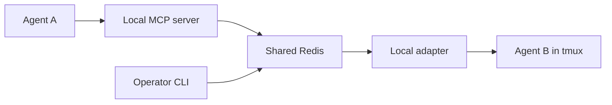
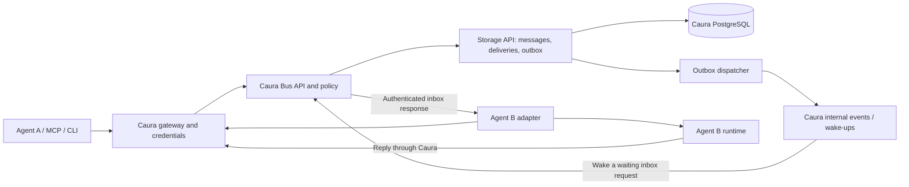

# Caura agent collaboration — implementation status and GA plan

## Current local implementation (2026-09-20)

The product objective is a **new native Caura capability**: discover agents,
communicate in real time, interrupt work, and notify an authorized human when
Caura decides input is required. The Docker environment is its acceptance-test
fixture. The original review below predates implementation and is retained as
an evidence trail; its present-tense findings describe the old baseline.

Implemented locally on `codex/caura-platform-foundation`, after adopting official
Caura Bus `8af62c7`:

- Mandatory Caura authentication/API/storage for every exchange; transactional
  messages, idempotency, delivery leases, participant history and crash recovery.
- Expiring session presence, capability discovery and durable resumable events.
- Caura checkpoint policy for confidence, missing/conflicting information and
  consequential actions, plus explicit agent escalation and retry exhaustion.
- Human messaging, current-owner/admin oversight, manual interruption, confirmed
  runtime stoppage, versioned decisions and decision context on resumed work.
- Native Enterprise dashboard page, conversation composer, work controls,
  intervention review and persistent navigation notifications using real Caura
  sessions and CSRF handling.
- SDK/MCP/CLI integration, PostgreSQL regression tests, CI coverage/lint gates,
  pinned official platform builds and isolated local acceptance automation.

The integration lives inside the optional native core entrypoints and
the official Enterprise frontend. It has not been merged upstream. Local test
runtimes are deterministic; this does not qualify an arbitrary coding-agent
runtime or prove model judgment. External notification channels were left for
later; the durable Caura app inbox is the first channel.

The runtime design was revised on **2026-09-21**: retire tmux and keystroke
injection; ship MCP pull opcodes first, interactive hooks next, then supervised
headless runners. The accepted
[runtime contract](AGENT_COLLABORATION.md#runtime-contract-mcp-pull-hooks-and-supervised-execution)
is authoritative. The MCP pull baseline is implemented with PostgreSQL/API/MCP
transition tests; host timeout and live client qualification remain release gates.
The legacy tmux package, entrypoint and setup instructions have been removed. The historical baseline review below remains an evidence
trail, not authorization to keep an injection fallback in the product.

### Remaining GA work, in priority order

1. **MCP pull runtime contract.** Qualify the implemented `wait`, `reply`, `ack`,
   `progress` and model-facing checkpoints under the single `peer` tool. Test
   50-second waits, automatic 30-second lease renewal, one outstanding delivery,
   progress-based deadline extension, crash recovery with fresh tokens, bounded
   retries, idempotent acknowledgements and atomic replies bound to the claimed
   message. Tokens stay inside MCP; `human` takes a delivery ID and reason.
   Pull interruption is observable at the next call or supported turn boundary,
   not immediate preemption. Qualify hooks separately, then supervised runners
   for confirmed cancellation. Distinguish Caura fencing from runtime stoppage; expired unconfirmed work
   requires explicit operator acknowledgement. Qualify external-effect deduplication.
2. **Native upstream release integration.** Incorporate routes, lifecycle,
   feature flags, dashboard files and gateway rules into the official release
   pipelines. Exercise upgrades, migration rollback and tenant deletion across
   all new tables. Keep the platform/package licensing boundary explicit.
3. **Operational limits.** Add tenant backlog and stream quotas, configurable
   retention, pagination beyond current directory/inbox caps, audit export into
   Caura's existing audit surface, queue/latency metrics and escalation alerts.
   Current SSE reconciliation deliberately favors correctness over fleet-scale
   efficiency; benchmark before choosing a notification dispatcher.
4. **Authorization lifecycle.** Qualify credential revocation/rotation, user
   membership removal, fleet changes and enterprise policy combinations. Add
   server-managed peer policy where deployments need finer than tenant scope.
5. **Smarter escalation and usability.** Evaluate checkpoint signal quality
   using realistic tasks; policy currently operates on explicit structured
   signals rather than inferred natural-language risk. Add policy configuration
   UI, guided agent onboarding, richer conversation history and optional local
   notification delivery. Human decisions remain authoritative.
6. **Release qualification.** Run load, soak and failure campaigns, supported
   platform/runtime matrix, clean distributions, backup/restore and an opt-in
   beta. Publish measured latency and reliability targets, then decide GA.

See [LOCAL_HANDOFF.md](LOCAL_HANDOFF.md) for the live local URL, exact verification
results, files and commands. See [SPEC.md](../SPEC.md) for the implemented API and
[AGENT_COLLABORATION.md](AGENT_COLLABORATION.md) for the product contract.

### Runtime acceptance gate (revised 2026-09-21)

| Scenario | Required evidence |
|---|---|
| Tool surface and wake behavior | One `peer(op, args)` tool; no terminal injection or special-terminal setup. A waiting turn receives work; an idle client that never calls wait is not advertised as automatically woken. |
| Wait timeout and cancellation | Default 50-second wait completes below each supported client's configured timeout. Empty waits do not claim, ack or increment attempts. Cancellation or a lost response after claim is recovered by the same session's next wait. |
| Ordering and ownership | Repeated and concurrent waits cannot create two outstanding deliveries for one recipient. The owner receives its existing delivery; another session cannot steal its live lease. Paused work is explicitly non-runnable; skipping it requires a recorded resolution. |
| Process restart and retries | Kill MCP during work. Renewal stops; after the 30-second lease expires, a new authenticated session receives the same outstanding delivery with a fresh token and attempt plus one. Old tokens fail. Five failures park work for human review without a retry loop. |
| Legitimate long work | Progress or a permitted checkpoint extends the inactivity deadline without changing attempt count. Extension counts, summaries and timestamps survive restart. Retry of the same report does not extend twice. Renewals/waits alone do not extend processing time; silence pauses and notifies. |
| Completion and reply binding | Duplicate ack returns 200 for an already acknowledged delivery, including after restart, without acknowledging a newer attempt. Reply defaults to ack=true and commits both results atomically. Mismatched reply_to is rejected; ack=false preserves multi-step work. Lost-response retries produce one logical reply and completion. |
| Human context and token privacy | Wait includes the envelope, delivery ID, lease expiry, attempt, state, processing deadline, extension count and human resume context. Tokens are absent from tool output, prompts, UI and logs. The human opcode uses delivery ID and reason only. |
| Honest pull interruption | Interrupt during an active model turn; show that it is observed at the next Caura call or supported boundary. Caura fences late results immediately, while the UI does not claim the model stopped. Progress/ack cannot clear the pause; approval requiring stop confirmation remains blocked without evidence. |
| Interactive hooks (next milestone) | For each declared host/version, a boundary hook retrieves work without the agent remembering to wait. Busy turns, approval prompts, hook re-entry and session exit preserve ownership and ordering; do not claim arbitrary mid-turn preemption. |
| Supervised runners (fleet milestone) | The supervisor owns the delivery process lifecycle. Process and descendant cancellation, cleanup, lease loss and restart tests substantiate stop confirmation; external effects use idempotency or a documented recovery procedure. |

Run deterministic failure tests plus conformance tests against declared client
versions. A successful echo exchange does not establish any stronger runtime
or interruption guarantee. Progress reports are liveness signals, not proof
that task execution is advancing correctly.

## Post-GA backlog: policy-controlled memory capture

Phase 1 uses explicit agent calls to existing Caura memory tools after human
decisions, completion reports and design rulings. `peer memory_context` supplies
read-only provenance; there is no automatic bus memory write.

Phase 2 is backlog only: tenant policy `memory_capture = off | decisions |
completions | all`, default `off`. Caura would write decision/outcome memories
with authenticated conversation/delivery provenance for selected event classes:
`decisions` for recorded human decisions and explicit design rulings,
`completions` for explicit completion outcomes, and `all` for both classes.
This does not mean copying every message body. Policy changes and captures must
be governed by current tenant/ownership authority and durably audited like
governance reads, with idempotent event handling, retention/deletion and access
checks. Design event classification and failure recovery before implementation.
No phase-2 policy field, capture worker or automatic write is implemented now.

## Original baseline review


Reviewed 2026-09-20. The product should provide reliable, asynchronous conversations between independent agents, with every exchange passing through the Caura platform. Caura owns identity, authorization, durable messages, delivery state, and history; local MCP clients and runtime adapters connect to Caura. Completion includes a demonstrated, fully running local Docker environment on separate networks, with no changes to other running instances.

The current implementation is a useful end-to-end prototype. It is not ready for GA: it demonstrates successful delivery, but does not implement the recovery, authorization, or runtime acceptance guarantees the product needs.

At the time of this baseline review, no application code, credentials, live services, or repository remotes had been changed. The implementation status above supersedes the proposed sequence below.

The review covers these snapshots:

| Repository | Reviewed revision | Observation |
|---|---|---|
| This workspace | `cad8db5` | Original V1 implementation; predates the upstream rename. |
| [Official Caura Bus](https://github.com/caura-ai/caura-bus/tree/8af62c7395718c05b0bb919ab351af8f7028e7cd) | `main`, `8af62c7`, September 17 | Already renamed to `caura-bus`, `caura_bus_*`, and `CAURA_BUS_*`. |
| [Official Caura](https://github.com/caura-ai/caura/tree/fe096f7955bcae2db0b19358f4f0b069260ff7d4) | `main`, `fe096f7`, September 20 | Existing API, authentication context, agent records, storage, MCP, and event infrastructure. |
| [Official Caura Enterprise](https://github.com/caura-ai/caura-enterprise/tree/e9796a9c6a446ff693869adbb0e43982bee01db5) | Default branch `dev`, `e9796a9`, September 20 | Existing gateway, credential provisioning, audit, and deployment infrastructure. |

**Start implementation from official Caura Bus upstream.** The rename is already substantially done there. The transport, registry, adapter loop, tmux injection, MCP server, and CLI are unchanged from this workspace after normalizing branding. Repeating the rename on this old checkout would create unnecessary divergence.

The intended experience is straightforward: agent A asks agent B a question, keeps working, and receives B's response in the same conversation later. A developer can see whether the request was accepted, queued, delivered to a runtime, or answered, and can diagnose a stalled exchange without copying messages between terminals.

Today the path is:



The five-package separation, asynchronous interfaces, JSON envelope, and small adapter protocol are worth preserving. The current runtime is only about 1,450 lines of Python, so this is an appropriate time to establish the platform boundary and delivery contract.

I ran all **44 existing tests successfully in this workspace and all 44 in current upstream**, against disposable Redis and isolated tmux instances. Additional probes reproduced the failures below on both versions. The upstream run reused the installed dependency versions in a temporary Python environment; it was not a clean package-install or release-build test. Runtime: Python 3.13.2, Redis server 8.4.0, tmux 3.5a. Redis 7 compatibility, coverage percentage, production load, and live Claude sessions were not verified. The Caura platform repositories were inspected, not fully tested or deployed.

| Priority | Finding and evidence | Required outcome |
|---|---|---|
| P0 | All clients connect directly to Redis. There is no Caura API in the message path. [MCP startup](https://github.com/caura-ai/caura-bus/blob/8af62c7395718c05b0bb919ab351af8f7028e7cd/packages/mcp-server/caura_bus_mcp/server.py#L29), [adapter loop](https://github.com/caura-ai/caura-bus/blob/8af62c7395718c05b0bb919ab351af8f7028e7cd/packages/adapter-sdk/caura_bus_adapter/sdk.py#L66). | Every send, receive, reply, acknowledgment, history read, and administrative operation uses an authenticated Caura endpoint. |
| P0 | The shared secret is only checked for a nonempty environment value; it is never verified or used to authenticate the connection. The CLI bypasses this check and tenant routing. An arbitrary secret was accepted; raw publish delivered across tenants even with a registry attached. [Config](https://github.com/caura-ai/caura-bus/blob/8af62c7395718c05b0bb919ab351af8f7028e7cd/packages/bus-core/caura_bus_core/config.py#L54), [CLI send](https://github.com/caura-ai/caura-bus/blob/8af62c7395718c05b0bb919ab351af8f7028e7cd/packages/cli/caura_bus_cli/main.py#L174). | Reuse verified Caura credentials and enforce identity and routing on the server. |
| P0 | `subscribe()` reads only new entries using `>`. After stopping a consumer during a three-message batch, all three remained pending and none replayed on restart. [Consumer](https://github.com/caura-ai/caura-bus/blob/8af62c7395718c05b0bb919ab351af8f7028e7cd/packages/bus-core/caura_bus_core/bus.py#L129). | Durable delivery leases, recovery of unfinished work, and an explicit acknowledgment contract. |
| P0 | Re-publishing one envelope ID created two entries. A fan-out with a wrong-type destination raised an error after the first recipient had already received the message. [Publish](https://github.com/caura-ai/caura-bus/blob/8af62c7395718c05b0bb919ab351af8f7028e7cd/packages/bus-core/caura_bus_core/bus.py#L70). | Idempotent acceptance and durable per-recipient delivery records; retries must not create a new logical message. |
| P0 | tmux injection ignores command failures. A failed-command test double returned errors for both commands without `inject()` raising. The SDK would subsequently acknowledge the message. [Injection](https://github.com/caura-ai/caura-bus/blob/8af62c7395718c05b0bb919ab351af8f7028e7cd/packages/adapter-claude-code-tmux/caura_bus_adapter_claude_code/tmux_io.py#L77). | Acknowledge only a defined, observable delivery stage; preserve failed or ambiguous attempts. |
| P1 | Injected text contains only sender and body. The request ID, thread ID, kind, and correlation ID disappear, although the documented reply flow needs them. [Injection](https://github.com/caura-ai/caura-bus/blob/8af62c7395718c05b0bb919ab351af8f7028e7cd/packages/adapter-claude-code-tmux/caura_bus_adapter_claude_code/tmux_io.py#L85). | Preserve the envelope context and provide a reply operation that fills correlation and thread automatically. |
| P1 | Malformed JSON raises out of the consumer loop. A malformed entry followed by a valid one left both pending. Missing payloads are silently acknowledged. [Decode and acknowledge](https://github.com/caura-ai/caura-bus/blob/8af62c7395718c05b0bb919ab351af8f7028e7cd/packages/bus-core/caura_bus_core/bus.py#L154). | Bounded retries and durable quarantine with a reason; no silent discard. |
| P1 | Identity keys omit tenant. Registering the same agent ID in a second tenant overwrote the first record. Adapters create an inbox but never register an agent; only MCP startup does. [Registry](https://github.com/caura-ai/caura-bus/blob/8af62c7395718c05b0bb919ab351af8f7028e7cd/packages/bus-core/caura_bus_core/registry.py#L18). | Reuse Caura's tenant-scoped agent records; track connected sessions separately from agent identity. |
| P1 | History is an inbox sample, not a complete conversation. With five unrelated newer messages, a matching older message disappeared from a filtered query with limit 1. Sent messages are absent from the sender's history. [Recent](https://github.com/caura-ai/caura-bus/blob/8af62c7395718c05b0bb919ab351af8f7028e7cd/packages/bus-core/caura_bus_core/bus.py#L164). | Indexed, paginated thread history containing sent and received messages, with membership checks. |
| P1 | Stable pane output is treated as idle after 1.5 seconds. This cannot distinguish a ready prompt from a stalled tool, approval prompt, or shell after the agent exits. [Idle detector](https://github.com/caura-ai/caura-bus/blob/8af62c7395718c05b0bb919ab351af8f7028e7cd/packages/adapter-claude-code-tmux/caura_bus_adapter_claude_code/idle.py#L46). | Session-aware readiness and refusal to inject into unknown or unsafe states. |
| P1 | There are no application-level reconnect/backoff loops, delivery attempts, dead-letter tooling, retention limits, presence leases, or queue metrics. The envelope accepts empty recipient lists and unbounded bodies. | Explicit resource limits, lifecycle handling, operator diagnostics, and strict request validation. |
| P1 | Upstream CI runs naming/sentinel checks but not the application suite. Coverage is requested in project conventions but not enforced. Test cleanup deletes the shared registry index. [CI](https://github.com/caura-ai/caura-bus/blob/8af62c7395718c05b0bb919ab351af8f7028e7cd/.github/workflows/ci.yml), [cleanup usage](https://github.com/caura-ai/caura-bus/blob/8af62c7395718c05b0bb919ab351af8f7028e7cd/tests/integration/test_registry.py#L49). | Required isolated integration tests, failure tests, and release gates. |

There are also smaller inconsistencies: agent listing advertises peers the allow-list may prevent addressing; thread records expose only an ID; notify-channel names exist without a publisher/subscriber implementation; config examples in the loader place top-level fields under `[agent]`; and `replay` displays history without redelivering anything. The Dockerfile does not copy the lockfile or use a frozen install. Demo cleanup uses broad process-name matching and suggests deleting every `bus:*` key. Fix these as part of the relevant milestones below.

The revised architecture should be:



**The platform boundary is a product invariant.** Clients hold a Caura URL and a credential. They never receive Redis or database credentials, broker access, or an alternate peer address. A platform outage produces a retryable failure or a clearly marked local pending submission; it must never activate direct agent-to-agent delivery. Local development runs the same Caura API contract against a local platform instance.

The current upstream platform gives us concrete integration points:

| Existing component | Reuse in Caura Bus |
|---|---|
| [Gateway REST authentication](https://github.com/caura-ai/caura-enterprise/blob/e9796a9c6a446ff693869adbb0e43982bee01db5/gateway/nginx.conf.template#L1524) and [AuthContext](https://github.com/caura-ai/caura/blob/fe096f7955bcae2db0b19358f4f0b069260ff7d4/core-api/src/core_api/auth.py#L26) | Resolve credentials once through the platform and reuse tenant, agent, write-capability, and gateway-perimeter checks. Reject a conflicting asserted sender. |
| [Unified credentials](https://github.com/caura-ai/caura-enterprise/blob/e9796a9c6a446ff693869adbb0e43982bee01db5/platform-admin-api/src/platform_admin_api/routers/api_credentials.py#L51) and [whoami](https://github.com/caura-ai/caura/blob/fe096f7955bcae2db0b19358f4f0b069260ff7d4/core-api/src/core_api/routes/health.py#L127) | Use existing agent-scoped credentials, rotation, revocation, and identity diagnostics. Do not create a second credential system. |
| [Agent model](https://github.com/caura-ai/caura/blob/fe096f7955bcae2db0b19358f4f0b069260ff7d4/common/models/agent.py#L11) | Reuse `(tenant_id, agent_id)` identity and authoritative fleet membership. Add bus session presence separately. |
| [Storage API pattern](https://github.com/caura-ai/caura/blob/fe096f7955bcae2db0b19358f4f0b069260ff7d4/core-api/src/core_api/routes/agents.py#L14) | Put message acceptance and delivery-state transactions inside the storage service. API handlers should not perform disconnected writes across services. |
| [Internal event abstraction](https://github.com/caura-ai/caura/blob/fe096f7955bcae2db0b19358f4f0b069260ff7d4/common/events/base.py#L95) | Reuse platform events for wake-ups. Its in-process backend is explicitly non-durable; durable inbox records and reconciliation must make notification loss harmless. |
| [Remote MCP endpoint](https://github.com/caura-ai/caura-enterprise/blob/e9796a9c6a446ff693869adbb0e43982bee01db5/gateway/nginx.conf.template#L1657) | Offer the bus tools through Caura's existing MCP surface. Keep the local stdio server as a thin client for runtimes that need it. |
| [Request deadline middleware](https://github.com/caura-ai/caura/blob/fe096f7955bcae2db0b19358f4f0b069260ff7d4/core-api/src/core_api/middleware/request_timeout.py#L51) | Bound inbox long-polls below platform deadlines. A future SSE route needs deliberate timeout, buffering, connection-limit, and revocation handling. |

Recommended placement: add bus routes/service integration to Caura's API and transactional bus storage operations to its storage service. Keep this repository responsible for the reusable bus-domain package, client, CLI, MCP bridge, and adapters. Import the server package only on the platform side; public clients should not depend on Redis transport. Preserve the existing package license boundaries when wiring this in, and settle distribution ownership before copying code between differently licensed packages.

The initial public contract can stay small. These are proposed endpoints, not existing APIs:

| Operation | Proposed contract |
|---|---|
| Send | `POST /api/v1/bus/messages` with `Idempotency-Key`; returns message ID, thread ID, accepted time, and resolved recipients. |
| Receive | `POST /api/v1/bus/inbox/claim` with bounded wait and batch size; returns delivery IDs and lease tokens. Claiming mutates state, so it is not a history GET. |
| Confirm / retry | `POST /api/v1/bus/deliveries/{id}/ack`, `/renew`, and `/nack`; caller identity, ownership, and lease generation are verified. |
| History / status | Paginated `GET /api/v1/bus/threads`, `/threads/{id}/messages`, and `/messages/{id}`. |
| Presence | Authenticated session open, heartbeat, pause, and close operations. Presence reports runtime state without changing the agent's ownership or fleet. |
| Reply | Reply-to message ID on send; Caura verifies access and supplies the original thread and correlation ID. |

Use the existing Caura error envelope with stable codes and retry guidance. Start with HTTPS requests and bounded long-polling; add SSE only if the measured connection and latency profile calls for it. Keep sender/tenant/server timestamps authoritative. Responses must distinguish durable acceptance, adapter possession, runtime acceptance, and a later agent response.

Delivery design must address the failure boundaries explicitly:

- Accept the message, its resolved recipient set, delivery records, and an outbox event in one PostgreSQL transaction. Enforce a unique idempotency key scoped to tenant and sender, and reject reuse with a different payload. Broadcast recipients are snapshotted at acceptance so a retry cannot expand the audience.
- Treat events as wake-ups for durable records. A periodic reconciliation path must recover work even if an in-process event is lost or a dispatcher dies. Reuse existing platform infrastructure before adding another broker.
- Lease deliveries to a particular adapter session, with expiration, renewal, attempt count, and a fencing token. A stale adapter must not acknowledge or mutate a replacement session's delivery. Recheck authorization and revocation on claim, renewal, and acknowledgment.
- Preserve order per recipient using a server sequence and one active runtime consumer per agent for the initial release. Limit in-flight work while the runtime is busy. A quarantined or expired message creates a visible gap with an explicit continuation policy.
- Retry transient network failures with capped exponential backoff and jitter. Handle 429 using `Retry-After`; stop automatic retries for revoked credentials and invalid requests. Quarantine irrecoverable payloads and expose controlled redelivery.
- Enforce retention for bodies, history, delivery records, and idempotency records together. Never trim unfinished deliveries silently. Make expiration visible. Idempotency retention must cover the documented retry window.
- Track delivery states such as `queued`, `leased`, `runtime_accepted`, `expired`, `dead_letter`, and `uncertain`. A correlated reply is separate from delivery acknowledgment; a turn ending does not establish that the requested task succeeded.

Do not promise exactly-once agent execution. A crash after terminal injection but before acknowledgment leaves an inherently ambiguous side effect. Runtime adapters that support a stable message ID and an acceptance receipt can deduplicate it. The tmux adapter must expose ambiguity and offer a deliberate retry decision instead of silently reinjecting potentially destructive instructions.

If Redis Streams are retained for any server-side transitional queue, pending-entry recovery must be explicit; `>` alone does not recover previously delivered entries. Redis provides [`XAUTOCLAIM`](https://redis.io/docs/latest/commands/xautoclaim/) for stale pending entries. Simply changing to a Redis transaction is not a complete fan-out/retry design: Redis transactions [do not roll back commands on runtime errors](https://redis.io/docs/latest/develop/using-commands/transactions/). The preferred GA path is the platform's durable storage contract above.

**Make the product smart through conversation continuity and runtime awareness.** The highest-value additions are deterministic:

- Add a `reply` opcode to `peer(op, args)` so the agent does not reconstruct thread and correlation fields. The existing `send` opcode returns an accepted receipt.
- Deliver a compact context header containing sender, message ID, thread, kind, and reply-to, followed by the original body. Label it as peer input; it does not grant new execution permissions.
- Show complete thread history, unread positions, unanswered requests, and whether the peer is offline, busy, ready, blocked on approval, or disconnected. Catch-up reads must not mark delivery as consumed.
- Bound automated back-and-forth using per-agent and per-thread rate limits, expiry, and an operator pause switch. Preserve messages and sequence; do not silently combine them.
- Use supported runtime lifecycle events where possible. Claude Code documents `UserPromptSubmit`, `Stop`, and notification hooks that can help track state; exact support needs a pinned-version conformance test. See the [official hooks reference](https://code.claude.com/docs/en/hooks). Keep the quiet-screen heuristic as an explicitly weaker fallback.
- Keep message transport separate from memory enrichment. An optional, governed Caura memory integration can later retain selected outcomes with provenance. No LLM routing, automatic message summarization, or memory write should be required to deliver a message.

The rollout should follow these dependent milestones. Effort estimates are engineering days for implementation and tests by someone familiar with the platform; they exclude review queues and the beta observation period. They are planning ranges, not a delivery commitment.

| Milestone | Work and ownership | Exit condition | Estimate |
|---|---|---|---|
| 0. Establish the canonical baseline | Bus maintainer: adopt official upstream; update the product spec to require Caura mediation; record protocol, deployment, and license decisions. | Working branch based on upstream, current branding, explicit acceptance/delivery contract, and scoped release backlog. | 1–2 days |
| 1. Prove one platform-mediated round trip | Platform + bus: add an authenticated send/claim/ack path, transactional durable records, minimal async client, and echo adapter. Start the isolated Docker harness here. | Two independent processes exchange a message and response through Caura with no Redis access. Wrong-tenant and forged-sender requests fail. | 5–8 days |
| 2. Prove failure recovery | Platform/storage + bus: idempotency, leases, fencing, reconciliation, retries, quarantine, ordering, expiry, and complete history. Convert the reproduced failures into regression tests at the new boundary. | Kill/restart tests at each commit/claim/accept/ack boundary have the documented result; no accepted message disappears. | 5–8 days |
| 3. Make real agent exchanges dependable | Adapter + MCP: preserve metadata, implement replies, runtime state tracking, session ownership, checked injection, and ambiguous-delivery handling. | Multi-turn request/response works with a real supported Claude Code version; busy, approval, exit, restart, multiline, and Unicode cases pass. | 4–7 days |
| 4. Make setup and operations simple | CLI + platform: setup/doctor/status/pause commands, credential reuse, platform history/status, scoped cleanup, service supervision, and tested quickstarts. | A new developer completes a two-agent exchange without editing TOML or MCP JSON by hand and can explain a stalled delivery from diagnostics. | 3–5 days |
| 5. Demonstrate the complete local environment | Bus + platform: finish the isolated Docker stack, local seeding, two-agent demonstration, fault exercise, diagnostics bundle, and scoped teardown. | The live demonstration and automated isolation checks below pass while unrelated instances remain running. | 3–5 days |
| 6. Qualify the release | Release + platform: required CI, packaging, container builds, deployment configuration, metrics, quotas, retention, upgrade/rollback, load/soak tests, and beta. | All release gates below pass; platform staging and beta show the same contract as local tests. | 4–7 days plus beta |

That is roughly **25–42 engineering days**, with the architecture and runtime-acceptance work carrying the most uncertainty. Re-estimate after milestone 1. Do not spend a separate sprint hardening client-side Redis paths that the platform boundary will remove.

The first five reviewable implementation changes should be: (1) upstream baseline and revised specification, (2) platform bus schemas/storage/auth contract, (3) async Caura client plus a real two-process API test, (4) idempotency and recovery fault tests, and (5) metadata-preserving adapter plus reply tool. Keep each change deployable behind a tenant feature flag.

For usability, aim for this proposed flow:

```text
caura-bus init --url https://caura.ai --agent broker-agent
caura-bus doctor
caura-bus connect --runtime claude-code --target broker:0.0
caura-bus status
caura-bus messages show <message-id>
caura-bus pause
```

`init` should reuse Caura credentials, verify the effective identity, validate allowed peers, and generate the required local configuration. `doctor` should report platform reachability, credential scope, peer eligibility, adapter state, pane identity, and a safe test-delivery result. Config errors should identify the field and remediation. Use strict validation and documented CLI/env/file precedence. Expose `--json` for automation and readable output for humans. Supervision and demo cleanup must track owned processes and sessions rather than kill everything matching a program name.

**The local Docker demonstration is a required deliverable.** The current echo-only Compose file does not qualify: it has neither a Caura platform nor an authenticated platform-mediated exchange. The upstream enterprise Compose file also publishes fixed ports including 80, 5432, and 6379, so changing only its network would still collide with running installations. Build a dedicated `compose.demo.yml` with explicit dependency versions and a validated, self-contained configuration.

The demo must run the actual Caura gateway, authentication/provisioning services, relevant storage services, core API with the bus feature, PostgreSQL, Redis, and local Pub/Sub emulator where used. Include audit and workers needed by the enabled profile and the existing Caura dashboard for inspection. Add two independently running agents and their adapters. Use real local services for auth, storage, and delivery; use a local seeded tenant, two agent-scoped credentials, and an additional tenant for the rejection test. Disable unrelated outbound integrations such as email delivery, billing webhooks, and operational bots.

Isolation must cover resources as well as network names:

- Allocate a unique Compose project per run, such as `caura-bus-demo-<run-id>`. Networks, containers, images built for the run, and volumes must be scoped to it. Avoid fixed `container_name`, shared external networks, and external volumes. Compose's [project-scoped networking](https://docs.docker.com/compose/how-tos/networking/) provides the basis; databases belong on an [internal network](https://docs.docker.com/reference/compose-file/networks/).
- Put platform dependencies on a private backend network. Give each demo agent a separate client network with access to the gateway, so it cannot address the other agent or the database directly. Publish only the gateway/UI entry point on a Docker-assigned loopback port and report the resulting URL. Do not publish PostgreSQL, Redis, or emulator ports.
- Use a generated per-run environment file and credentials, local service DNS names, and a separate emulator project ID. Validate the rendered Compose configuration before startup. Do not load the developer's production environment or cloud credentials, mount their runtime home, or fall back to `caura.ai` on a missing setting.
- Set explicit resource limits so the demo cannot consume unbounded CPU or memory on a shared development machine. Configure health/readiness checks and wait for migrations and seeding to complete before starting the exercise.
- Keep a run manifest recording the Compose project, local URL, revisions, and owned resources. Teardown targets only that project and its volumes. Never use Docker system prune, global Redis cleanup, broad process matching, or another application's tmux server.
- Verify that two demo runs can coexist with distinct networks, volumes, and published ports. Compare pre-existing container IDs, network attachments, and health before and after startup and teardown.

Deliver a single-command interface and a saved diagnostics bundle. Proposed commands, to be implemented:

```text
caura-bus demo up --full --isolated
caura-bus demo run --scenario request-response
caura-bus demo run --scenario restart-recovery
caura-bus demo inspect
caura-bus demo down --purge
```

The live demonstration must show this sequence:

1. Start the complete environment while other local instances are running. Print its unique project, gateway URL, network names, and readiness status.
2. Resolve each agent's identity through local Caura. Agent A sends a request to B; B receives it through Caura and responds in the same thread. Show the message IDs, delivery states, and both sides of history.
3. Keep B busy, queue another request, then allow its runtime to become ready. Show that delivery respects runtime state.
4. Stop B's adapter before acknowledgment, restart it, and demonstrate the documented recovery behavior. Repeat a send with the same idempotency key and show one logical message. Include the uncertain-injection case if using tmux.
5. Attempt a cross-tenant send and an unauthorized history read. Show platform rejection without revealing the other tenant's message content.
6. Stop the local platform and show that no exchange bypasses it. Restore it and show recovery of already accepted work.
7. Export redacted logs, traces, message history, health results, and the scenario report. Tear down only the demo and confirm pre-existing instances remain running.

Maintain a deterministic scripted-agent version of the same scenarios for CI, requiring no model API credentials. Also demonstrate a pair of real supported agent sessions for the user-facing runtime claim; scripted agents alone do not prove Claude Code readiness handling. Real-model credentials, if needed, are supplied explicitly to isolated demo sessions. Hosted model inference can use a documented optional egress path; message transport, identity, storage, and peer delivery still remain in the local Caura environment.

The naming migration is primarily adoption and verification now:

| Surface | Canonical outcome |
|---|---|
| Product and repository | Caura Bus, `caura-ai/caura-bus` |
| Python distributions/imports | `caura-bus-*` / `caura_bus_*`; add the HTTP client here or to the existing official client without creating a competing identity model. |
| Commands and configuration | `caura-bus`, `caura-bus-mcp`, `caura-bus.toml`, `CAURA_BUS_*`; reuse `CAURA_API_KEY` and Caura URL conventions. Retire the bus shared-secret setting when platform auth takes over. |
| Documentation and artifacts | Caura terminology in package metadata, README, spec, templates, demos, loggers, image names, lockfile, examples, generated artifacts, and tests. |
| Persistent state | Explicitly version and tenant-scope new bus storage. Existing `bus:*` data needs an import/drain decision, not a textual rename. |
| External protocol identifiers | Use current Caura credentials as issued. The platform's existing credential wire prefix is an authentication contract, not something a project rename should rewrite. |

Do not add legacy aliases to the new GA client by default. If existing deployments need migration, provide a separate, explicit importer that maps tenant/agent identities, preserves original IDs, inventories pending deliveries, and quarantines uncertain attempts. Freeze old writers during cutover. Do not dual-deliver to old and new paths. Rollback should pause platform delivery or restore the prior platform release; it must not re-enable direct Redis clients. New installs never need the importer.

GA must be gated by observable outcomes:

| Gate | Required evidence |
|---|---|
| Platform mediation | Clients work with only the Caura endpoint reachable; sends, replies, receives, history, and acknowledgments all appear in platform traces. Caura unavailable means no peer delivery. |
| Authorization | REST, remote MCP, local MCP bridge, CLI, history, session leases, and replay enforce the same tenant/agent rules. Test header spoofing, wrong recipient, duplicate agent names in separate tenants, revoked credentials, changed fleet policy, and nonmember thread access. Cross-tenant memory-read privileges must not automatically authorize bus inbox access. |
| Delivery recovery | Process kills before/after acceptance, event publication, claim, runtime acceptance, and acknowledgment; lost HTTP responses; database/broker outages; duplicate submission; worker replacement; poison messages; full queues. No unexplained loss or duplicate logical message. Ambiguous runtime side effects are surfaced. |
| Conversation correctness | Complete sent/received history, stable thread membership, automatic reply correlation, pagination beyond unrelated traffic, multiple recipients, deterministic ordering, and bounded requests. |
| Runtime behavior | Superseded by the [revised runtime acceptance gate](#runtime-acceptance-gate-revised-2026-09-21): MCP pull first, host hooks next, supervised runners for fleet use. Qualify timeout, ownership, progress, recovery, reply/ack and honest interruption semantics; terminal injection does not qualify. |
| Complete local demonstration | Full Docker environment and two-agent conversation demonstrated on isolated networks. Recovery and authorization scenarios pass; two demo projects coexist; pre-existing instances are unchanged by startup and cleanup. |
| Installation and release | Clean wheel installs, console-script smoke tests, frozen builds, non-root runtime images, versioned schemas, compatibility tests, published docs, and exercised upgrade/rollback. Ratchet checks remain alongside application CI. |
| Test quality | Real disposable dependencies in CI; required integration tests cannot silently skip. Enforce the existing ≥80% core coverage requirement and direct tests for every delivery/auth state transition. |
| Operations | Metrics for queue depth/oldest age, attempts, time in each state, offline/blocked sessions, acceptance/delivery latency, failed auth, and quarantine. Correlated logs use IDs and redact credentials and bodies by default. Retention and tenant deletion include all bus data. |
| Performance and beta | Publish a reproducible benchmark and run a 24-hour soak plus a two-week opt-in beta. Count unexplained delivery loss, ambiguity, duplicate injection, setup failures, and operator intervention, not just HTTP success. |

Proposed initial benchmark: 100 connected agents, 50 messages/second, 2 KiB bodies, with a 10× burst for 60 seconds. Measure API acceptance, inbox availability, runtime wait, and model response time separately. Candidate release targets are p95 platform acceptance below 250 ms, p95 acceptance-to-available below 100 ms in one region, p95 ready-runtime delivery below 2 seconds, and recovery of expired leases within 30 seconds. Validate or revise these against the deployment environment; they are not current performance claims. Keep message body, fan-out, backlog, connection, and request-size caps configurable with documented defaults.

The product decisions still to close during milestone 0 are the initial scale/SLO commitment, whether GA includes self-hosted Caura as well as managed Caura, the default retention period, whether existing bus data must migrate, and server-package distribution under the current license split. These do not change the core recommendation: **build on the already-renamed upstream, make Caura the mandatory transport boundary, and prove recovery and runtime acceptance before adding broader agent features.**

## Native migration follow-ups

- Publish the OSS wire/client packages from Caura to the package index and replace
  Enterprise's preview sibling path sources with version pins before GA.
- Qualify a lease owner and authenticated session lifecycle before remote pull.
  Renewing from cached verified headers would bypass credential-revocation checks.
  Stateless remote MCP therefore supports non-lease peer operations only.
